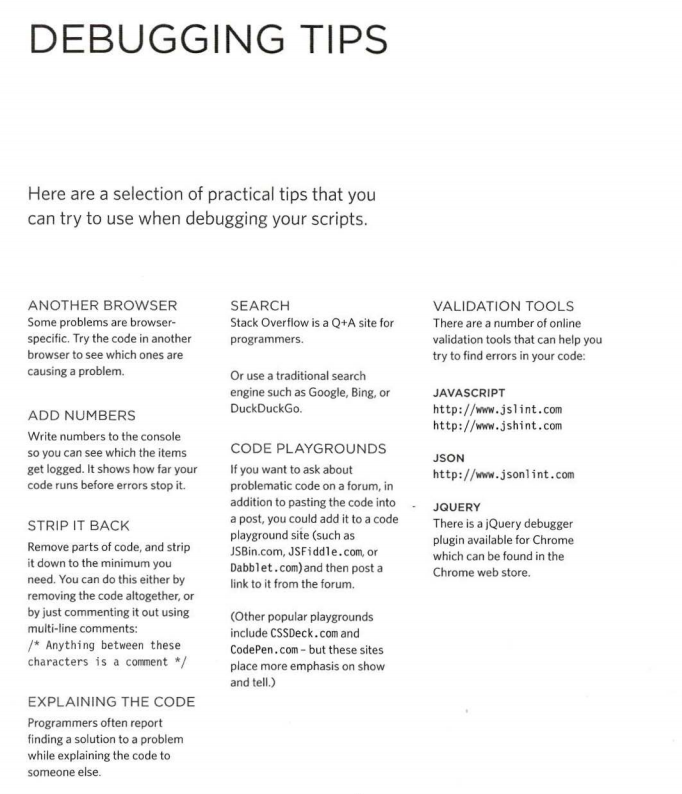

## Javascript Debugging

Stack: is when a function needed other function to run, JS interpreter make the needed function on top in order to run the new one .
Hoisting: You can call function before declaration (in function declatation only not expression).

The JavaScript console: will tell you when there is a problem with a script,
where to look for the problem, and what kind of issue it seems to be.

Debugging is about deduction: eliminating potential causes of an error.

You Can use Throw Error code to generate errors you know before interpreter creates them.
using : `throw new Error('Message');`

You can use Try, Catch, Finally code to fix an error

Try: to try to execute the code.
catch: if there is an exception run this code.
finally: this always gits executed.

`try {} catch(exception){} finally{}` 

If you want to write a set of related data to the console, you can use the `console.group()` method to group the messages together. You can then expand and contract the results. 

In browsers that support it, the `console. table()` method lets you output a table showing:
• objects
• arrays that contain other objects or arrays 

**Tips to do when debugging JS code :**

1. Use another browser
2. Add numbers in console log and move it line by line to see where is the error.
3. Comment the code line by line.
4. Explain the code to some one else (in explaining process you will figure out the problem)
5. Search online (Stackoverflow, W3schools)
6. Use Code Playgrounds (Jsbin.com, Jsfiddle.com, Dabblet.com), where you can ask in a fourm.
7. Use Validation Tools (Jslint.com, Jshint.com )

You can set a breackpoint within JS using `debugger;` keyword wherever you want in the script.

