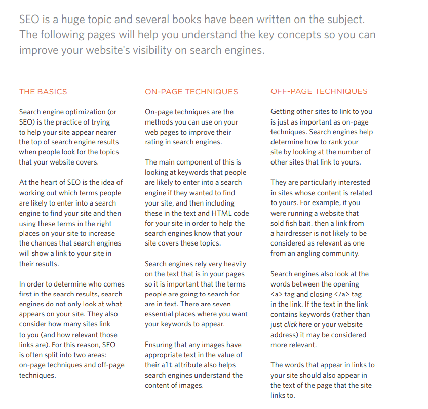

## IMAGES 

You can control images size in CSS using width and height properties.

you can aling images in CSS by using float property. 

Images by default are inline, You can center images in CSS by making it as a block element using `display: block;` property

You can make background images by using `background-image: url(" ");` property in CSS.

You can repeat the images using `background-repeat: ` property and give it a value either `repeat-x;` to repeat to image horizontally or `repeat-y;` to repeat it verticlly.

You can use `background-attachment:` property with either value `fixed;` to stay in the same position or `scroll;` to scroll the image up or down when the user scrolls.

When images are not repeated you can give them a position using `background-position:` property with a value of one of the following:

 

The background property acts like a shorthand for all of the other background properties you have just seen, and also the background-color property. The properties must be specified in the following order, but you can miss any value if you do not want to specify it.
1: background-color
2: background-image
3: background-repeat
4: background-attachment
5: background-position

You can use `background-position` property to change the appearance of an image each time the user `:hover` or click `:active` 

----------------------------------------------------------------------------------

Search engine optimization (or SEO) is the practice of trying to help your site appear nearer the top of search engine results when people look for the topics that your website covers.

  

  On PAGE Techniques: 

  

  **Use Google analytics services to analyze your visitors and target them better**

  Google Analytics provides you when register with a tracking link where you put it before closing the `</head>` to track your visitors.

  In order to put your site on the web you need two things: 
  1. Domain Name: for example www.nihad.com, you will have to pay annual fees for the website that rigister for you the domain, also these web sites offer web hosting.

  2. Web Hosting: Company that upload your website to WebServier. 

  To transfer your code and images from your computer to the hosting company you need File Transfer Protocol (FTP). there are many programs or websites that offer to you FTP by drag and drop.

  ----------------------------------------

  The `<video>` and `<audio>` elements allow us to embed video and audio into web pages. [Link to see more about Audio and Video](https://developer.mozilla.org/en-US/docs/Learn/JavaScript/Client-side_web_APIs/Video_and_audio_APIs)

