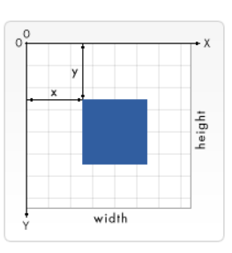

## Chart.js

You can make charts in Javascript by downloading chart.js files and added it to your repo and link it in the `<head>` of the HTML page.

You can use `<canvas>` to allow to JS to draw charts in HTML . give it and ID and width and height attribute. then you get this canvas by using `.geElementByID('id of canvas).getContext('2d')`  in getContext you can use 3d.

`<canvas>` element is like and Image element but with no src and alt attribute, and it can be styled just like any other image element.

**The default value of the canvas is top-left (as in a 2D shape of x (horizantal) and y (Vertical)**

----------------------------------------------

There are three functions that draw rectangles on the canvas:

1. fillRect(x, y, width, height) Draws a filled rectangle.
2. strokeRect(x, y, width, height) Draws a rectangular outline.
3. clearRect(x, y, width, height) Clears the specified rectangular area, making it fully transparent.

The `fillRect()` function draws a large black square 100 pixels on each side. The `clearRect()` function then erases a 60x60 pixel square from the center, and then `strokeRect()` is called to create a rectangular outline 50x50 pixels within the cleared square.

a Path in the canvas: is a series of points (dots) that you can draw a line between them to create shapes and fill it with colors.

`beginPath()` : Creates a new path. Once created, future drawing commands are directed into the path and used to build the path up.

Path methods
Methods to set different paths for objects:
`closePath()` : Adds a straight line to the path, going to the start of the current sub-path.
`stroke()` : Draws the shape by stroking its outline.
`fill()` : Draws a solid shape by filling the path's content area.( fill() will close the shape automaticlly)

`moveTo(x, y)` : like lefting the pen from one point on paper and put it on another point.
`lineTo(x, y)` : to draw line.

`arc(x, y, radius, startAngle, endAngle, anticlockwise)`: to create bending lines or cycles.

x and y are the coordinates of the center of the circle on which the arc should be drawn. 
radius is self-explanatory. 
The startAngle and endAngle parameters define the start and end points of the arc in radians, along the curve of the circle. 
These are measured from the x axis. 
The anticlockwise parameter is a Boolean value which, when true, draws the arc anticlockwise; otherwise, the arc is drawn clockwise.

`quadraticCurveTo(cp1x, cp1y, x, y)`
Draws a quadratic Bézier curve from the current pen position to the end point specified by x and y, using the control point specified by cp1x and cp1y.
`bezierCurveTo(cp1x, cp1y, cp2x, cp2y, x, y)`
Draws a cubic Bézier curve from the current pen position to the end point specified by x and y, using the control points specified by (cp1x, cp1y) and (cp2x, cp2y).

------------------------------------------------------------------

## Apply Styles and Colors : 

`fillStyle = color`: Sets the style used when filling shapes.
`strokeStyle = color`:Sets the style for shapes' outlines.

in color you can use: RGB, Hexa Decamil, RGBA, color Name.

There are several properties which allow us to style lines:

`lineWidth = value`: Sets the width of lines drawn in the future.
`lineCap = type` : Sets the appearance of the ends of lines.
`lineJoin = type` : Sets the appearance of the "corners" where lines meet.
`miterLimit = value`: Establishes a limit on the miter when two lines join at a sharp angle, to let you control how thick the junction becomes.
`getLineDash()`: Returns the current line dash pattern array containing an even number of non-negative numbers.
`setLineDash(segments)` : Sets the current line dash pattern.
`lineDashOffset = value` : Specifies where to start a dash array on a line.

The `miterLimit` property determines how far the outside connection point can be placed from the inside connection point. 

The `setLineDash` method and the `lineDashOffset` property specify the dash pattern for lines. 

to create Gradients :

`createLinearGradient(x1, y1, x2, y2)` :Creates a linear gradient object with a starting point of (x1, y1) and an end point of (x2, y2).
`createRadialGradient(x1, y1, r1, x2, y2, r2)`: Creates a radial gradient. The parameters represent two circles, one with its center at (x1, y1) and a radius of r1, and the other with its center at (x2, y2) with a radius of r2.
`createConicGradient(angle, x, y)`: Creates a conic gradient object with a starting angle of angle in radians, at the position (x, y).

`gradient.addColorStop(position, color)`:Creates a new color stop on the gradient object. The position is a number between 0.0 and 1.0 and defines the relative position of the color in the gradient.

The type specifies how to use the image in order to create the pattern, and must be one of the following string values:

`repeat` : Tiles the image in both vertical and horizontal directions.
`repeat-x` : Tiles the image horizontally but not vertically.
`repeat-y` : Tiles the image vertically but not horizontally.
`no-repeat` : Doesn't tile the image. It's used only once.

----------------------------------------------------------------------

## Drawing Text:

`fillText(text, x, y [, maxWidth])` : Fills a given text at the given (x,y) position. Optionally with a maximum width to draw.
`strokeText(text, x, y [, maxWidth])` : Strokes a given text at the given (x,y) position. Optionally with a maximum width to draw.

## Text Style:

`font = value`:The current text style being used when drawing text. This string uses the same syntax as the CSS font property. The default font is 10px sans-serif.
`textAlign = value`: Text alignment setting. Possible values: start, end, left, right or center. The default value is start.
`textBaseline = value` :Baseline alignment setting. Possible values: top, hanging, middle, alphabetic, ideographic, bottom. The default value is alphabetic.
`direction = value`: Directionality. Possible values: ltr, rtl, inherit. The default value is inherit.

`measureText()`: to measure the width of text by pixels. 