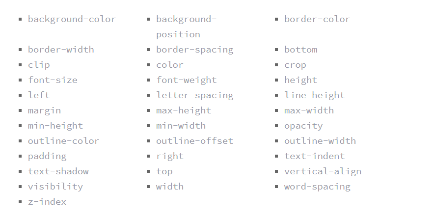

## CSS TRANSFORMS 

Transform syntax:

`-webkit-transform: scale(1.5);`
`-moz-transform: scale(1.5);`
`-o-transform: scale(1.5);`
`transform: scale(1.5);`

- Rotate value: to rotate the element 0 to 360 degrees . `  transform: rotate(-55deg);`
- Scale value: to change the appearance of the element and its default value is 1. You can change the width only using scalyX or the height only using scaleY. `  transform: scale(.5, 1.15);`
- Translate value: its like relative positioning, where you can change the location of an elelment without affecting other element. you can change the position horizontally using translateX or vertically using translateY. ` transform: translate(-10px, 25%);` 
- Skew value: to distorte elements either vertically or horizontally. ` transform: skew(5deg, -20deg);`

You can combine transform values together : `transform: skew(10deg, 20deg) translateX(20px);`

You can make matrix using the transgorm property.

Transform-origin property has two values (horizontally and vertically) : its like changing the positioning of the element.

Perspective value: to change the depth (3D) and can be used inside transform `transform: perspective(200px) rotateX(45deg);` or for the whole parent element. it also has `perspective-origin` value.

rotateZ value: to rotate in the Z axe (depth) `  transform: perspective(200px) rotateZ(45deg);`
scaleZ value : to scale in the z axe `transform: perspective(200px) scaleZ(.25) `
translateZ value: negative = push, positive = pull on the z axe.

Skew has no z axe value. 
 
` transform-style: preserve-3d;` : it need to be in the parent element to allow the nested children to transform in 3d 

`backface-visibilty`: it has two values either visible or hidden, to show or hide elements.

---------------------------------------------------------------------------------------------------

## Transition and Animation

in order to do transition for any element you must have diffirent styles and the best way to change states styles is by using :hover, :focus, :active, and :target pseudo-classes.

`transition-property` : to identify which property to apply the tranistion on. `transition-property: background, border-radius;`

The most populr tranistion properties are :

you can set a duration to the transition by using `  transition-duration: 1s;`  with a value of seconds (s) or millisecond (ms) and all the general timing values.

`transition-timing-function:`: to set the speed of the transition to move.

` transition-delay:` : to delay the starting of transition move.