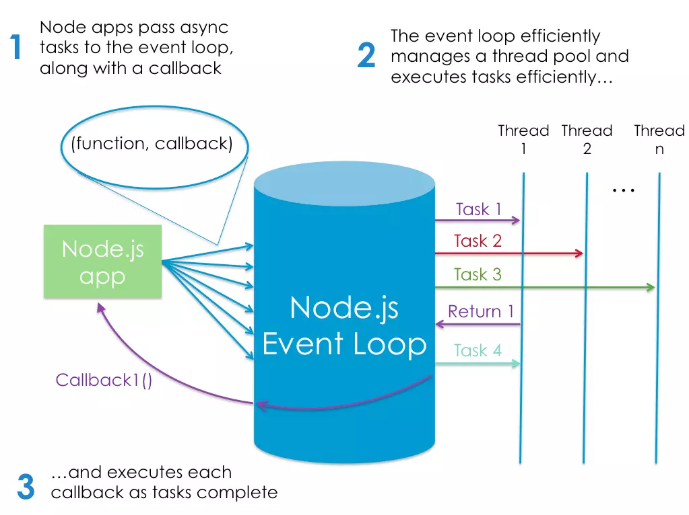

# Node.JS

Node.js: is a JavaScript runtime built on Chrome’s V8 JavaScript engine. OR
Node.js: is an (event-based),(non-blocking, asynchronous I/O) runtime that uses Google’s V8 JavaScript engine and libuv library.

When saying that Node is built on the V8 engine, we don’t mean that Node programs are executed in a browser. They aren’t. Rather, the creator of Node (Ryan Dahl) took the V8 engine and enhanced it with various features, such as a file system API, an HTTP library, and a number of operating system–related utility methods.

This means that Node.js is a program we can use to execute JavaScript on our computers. In other words, it’s a JavaScript runtime.
As can be seen on this compatibility table, Node has excellent support for ECMAScript 2015 (ES6) and beyond. 

#### How to downloade Node.js ?

You either download node binaries for your system, Or download npm (node package manager) in which will allow you to install multiple versions of node. Also npm is very large registry and it has bilions of packages

###### To download node package golabally on your system: 

install package golbally `npm install -g jshint` (the -g means global)

###### To download node package locally on your project: 

 `npm init -y`  This will create and auto-populate a package.json file in the same folder. 
 Then install and save the package into the project `npm install lodash --save`

This will create (node_modules) folder into your project. This is where npm will save the package and any libraries that package depends on.

inside package.json file, you’ll see all the packages listed under the dependencies field. By specifying your project’s dependencies in this way, you allow any developer anywhere to clone your project and use npm to install whatever packages it needs to run.

-------------------------------------

#### What Is Node.js Used For?
Designed to automate the process of developing a modern JavaScript application.

Also to use JS framework such as (React or Angular) you should use npm because all these frameworks available via npm and rely on Node to create a sensible development environment in which they can run.

-----------------------------------------------

#### The Node.js Execution Model: 

Node.js is an event-driven meaning everything happening on node is reaction of event. (meaning it uses callback functions, and do not wait until the process is finished and node uses libuv library to done this asynchronous (non-blocking) behavior) 

  
-------------------------------------------------

What Kind of Apps Is Node.js Suited To?

Node is particularly suited to building applications that require some form of real-time interaction or collaboration — for example, chat sites, or apps such as CodeShare, where you can watch a document being edited live by someone else.

---------------------------------------

What Are the Advantages of Node.js?

- Speed and Scalability.
- Your brain no longer needs to switch modes. You can do everything in the same language (JS), which, as a developer, makes you more productive (and hopefully, happier).
- Uses JSON as a data exchange format on the web. and MongoDB for interacting with Database. 
   JSON is ideally suited for consumption by a JavaScript program, meaning that when you’re working with Node, data can flow neatly between layers without the need for reformatting. You can have one syntax from browser to server to database.
- It's easire to transform to using Node.js as JavaScript language in used by many programmers.
