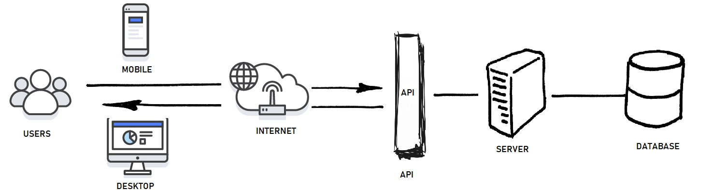

# APIs

A REST API (also known as RESTful API) is an application programming interface (API or web API) that conforms to the constraints of REST architectural style and allows for interaction with RESTful web services. REST stands for representational state transfer and was created by computer scientist Roy Fielding.

### Important websites to get API keys :

https://www.nps.gov/subjects/developer/api-documentation.htm

https://locationiq.com/

https://www.weatherbit.io/

https://www.yelp.com/developers/documentation/v3/business_search

https://developers.themoviedb.org/3/getting-started/introduction