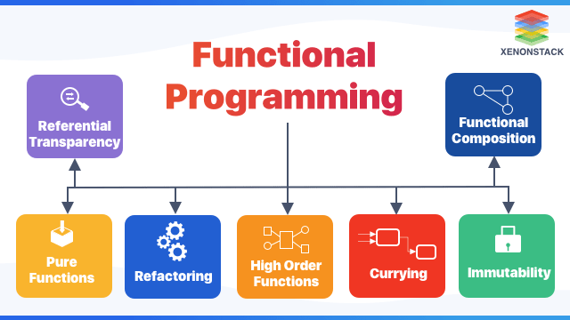

## Refactoring

#### Functional programming (often abbreviated FP) is the process of building software by composing pure functions, avoiding shared state, mutable data, and side-effects.

-----------------------------------------------------------------------------

##### IMPORTANT CONCEPTS:

A pure function is a function which:
- Given the same inputs, always returns the same output.
- Has no side-effects.

Function composition is the process of combining two or more functions in order to produce a new function or perform some computation. 

Shared state is any variable, object, or memory space that exists in a shared scope, or as the property of an object being passed between scopes.
The problem with shared state is that in order to understand the effects of a function, you have to know the entire history of every shared variable that the function uses or affects.

An immutable object is an object that can’t be modified after it’s created. Conversely, a mutable object is any object which can be modified after it’s created.

creating objects with `const` you can change the properties in that obj, and this is not what immutable means.

Example on creating immutable objs : 

const a = Object.freeze({
  foo: 'Hello',
  bar: 'world',
  baz: '!'
});

-----------------------

Tries use structural sharing to share reference memory locations for all the parts of the object which are unchanged after an object has been copied by an operator, which uses less memory, and enables significant performance improvements for some kinds of operations.

Functional programming tends to reuse a common set of functional utilities to process data. Object oriented programming tends to colocate methods and data in objects. 

A higher order function is any function which takes a function as an argument, returns a function, or both. example `map()`. Higher order functions are often used to:
 - Abstract or isolate actions, effects, or async flow control using callback functions, promises, monads, etc…
 - Create utilities which can act on a wide variety of data types
 - Partially apply a function to its arguments or create a curried function for the purpose of reuse or function composition
 - Take a list of functions and return some composition of those input functions

###### Conclusion
Functional programming favors:
  - Pure functions instead of shared state & side effects
  - Immutability over mutable data
  - Function composition over imperative flow control
  - Lots of generic, reusable utilities that use higher order functions to act on many data types instead of methods that only operate on their colocated data
  - Declarative rather than imperative code (what to do, rather than how to do it)
  - Expressions over statements
  - Containers & higher order functions over ad-hoc polymorphism

-----------------------------------------------------------------------------------

I used this link instead of that, because that one needs a subscription fees.

https://medium.com/javascript-scene/master-the-javascript-interview-what-is-functional-programming-7f218c68b3a0#:~:text=Functional%20programming%20(often%20abbreviated%20FP,state%20flows%20through%20pure%20functions.

