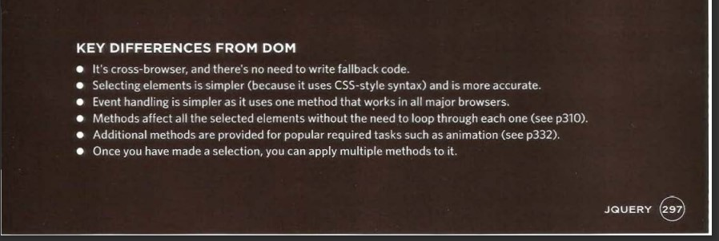
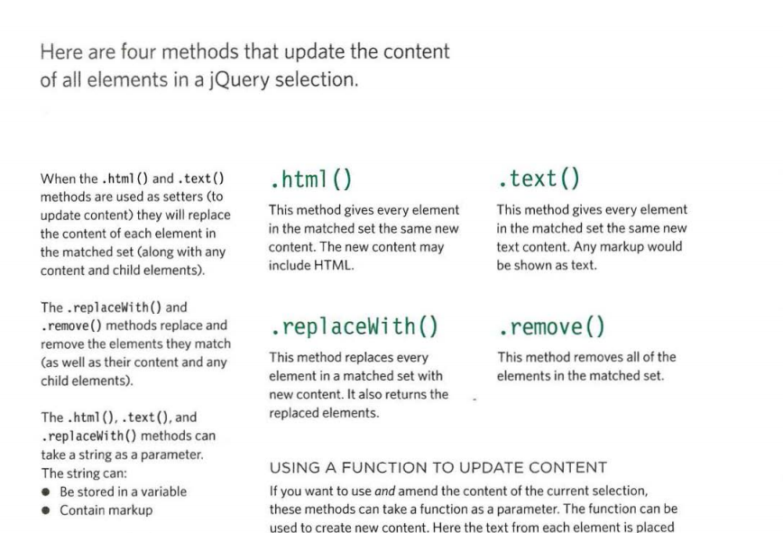
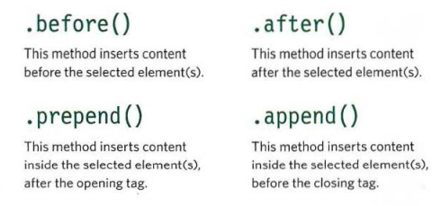
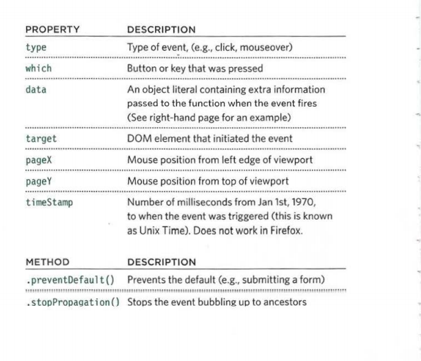

## JQuery 

JQuery: is a JS library (file) that provide a lot of shortcuts in writing codes for JS.

it uses CSS-style as a selector approach to find elements. `$()` is a function that create Jquery object (Started code).

We use JQuery because of the simpler selector and less code to atcheive common tasks. 

Matched set, is when you selecet one element or more in JQuery. 

If the JQuery selector hold many elements it will get data only for the first element, but will update data for all the selected one. To update one element you should use more specific selector. 

JQUERY stores referance to the objects, but not copy them.

When create JQuery using Variable it stores a referance to the variable (Caching a Jquery). We usually use  `$` with the variable name to diffrinciate that it stores JQuery object.

The ability to update all of the elements in the jQuery selection is known as implicit iteration. 

CHAINING: is to make each new method in JQUERY in a single line to be more readable.

`$().ready() { functions to run }` is to check if the HTML page ready first to run the code.

The  `.html()` and `.text()` methods both retrieve and update the content of elements.

.html() to retrieve and update the whole element.
.text() to update the text only (content of the element).

INSERTING ELEMENTS in JQUERY insist of two steps: 
1. create the new element .
2. use a method to insert a content .

These four methods to insert the content to the page:

You can create attributes, or access and update their contents, using the following four methods: 

`.attr()`
`.removeAttr()`
`.addClass()`
`.removeClass()`

The `.css ()` method lets you retrieve and set the values of CSS properties.

`.each()` is like a loop in JS where you can apply a method or more in each element selected.

The `.on()` method is used to handle all events Behind the scenes. 

You can use these property on handiling events function  exp :`( ' li ').on( 'cl ick' function(e) eventType = e. type ; });`

------------------------------------------------------

### You can use CDN (Content Delivery Network) method to include JQUERY into your webpage. using these scripts in HTML 

` `

