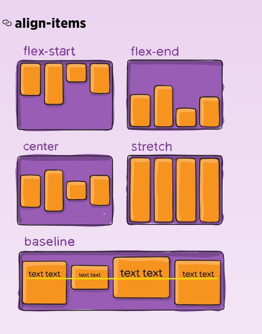

#### Javascript templating 
Is a technique to render HTML pages with JS using JSON data source. It is more efficient and faster way to render.

JS Template take variablies and inctances then replace it with actual values of these variables or inctances and convert it to HTML file in the running time.

#### Mustache 
is a logic-less template syntax. It can be used for HTML, config files, source code — anything. It works by expanding tags in a template using values provided in a hash or object.

They called logic-less because there are no if statement, or loops in it

#### Mustache-Express
If you intend you use mustache with Node and Express, you can use mustache-express. Mustache Express lets you use Mustache and Express together easily.
To install:

With Yarn:
`$ yarn add mustache-express`
or with NPM:
`$ npm install mustache --save`

---------------------------------------------------------------------------

### Flexbox layout 

Is a way to give the container ability to moadify and altr it's children sizes, hieght, width and order to fit with the availabe space (or Screen size). (Flexible Box)

Note: Flexbox layout is most appropriate to the components of an application, and small-scale layouts, while the Grid layout is intended for larger scale layouts.

#### Properties for the Parent (flex container)
- .container { 
  display: flex; /* or inline-flex */
   }

- .container {
  flex-direction: row | row-reverse | column | column-reverse;
  }

- .container {
  flex-wrap: nowrap | wrap | wrap-reverse;
  }

-.container {
  flex-flow: column wrap
  ;}  : This is a shorthand for the flex-direction and flex-wrap properties, which together define the flex container’s main and cross axes. The default value is row nowrap.

- .container {
    justify-content: flex-start | flex-end | center | space-between | space-around | space-evenly | start | end | left | right ... + safe | unsafe;
    } 
    

- .container {
  align-items: stretch | flex-start | flex-end | center | baseline | first baseline | last baseline | start | end | self-start | self-end + ... safe | unsafe;
  } : This defines the default behavior for how flex items are laid out along the cross axis on the current line. Think of it as the justify-content version for the cross-axis (perpendicular to the main-axis).

- .container { 
   align-content: flex-start | flex-end | center | space-between | space-around | space-evenly | stretch | start | end | baseline | first baseline | last baseline + ... safe | unsafe;
    }

-----------------------------------------------------------

##### Flexbox requires some vendor prefixing to support the most browsers possible. It doesn’t just include prepending properties with the vendor prefix, but there are actually entirely different property and value names. 

here’s a Sass @mixin to help with some of the prefixing, which also gives you an idea of what kind of things need to be done:

@mixin flexbox() {
  display: -webkit-box;
  display: -moz-box;
  display: -ms-flexbox;
  display: -webkit-flex;
  display: flex;
}

@mixin flex($values) {
  -webkit-box-flex: $values;
  -moz-box-flex:  $values;
  -webkit-flex:  $values;
  -ms-flex:  $values;
  flex:  $values;
}

@mixin order($val) {
  -webkit-box-ordinal-group: $val;  
  -moz-box-ordinal-group: $val;     
  -ms-flex-order: $val;     
  -webkit-order: $val;  
  order: $val;
}

.wrapper {
  @include flexbox();
}

.item {
  @include flex(1 200px);
  @include order(2);
}

#### justify-content property, which aligns items horizontally and accepts the following values:

- flex-start: Items align to the left side of the container.
- flex-end: Items align to the right side of the container.
- center: Items align at the center of the container.
- space-between: Items display with equal spacing between them.
- space-around: Items display with equal spacing around them.

--------------------------------------------------------------------------------------------------

