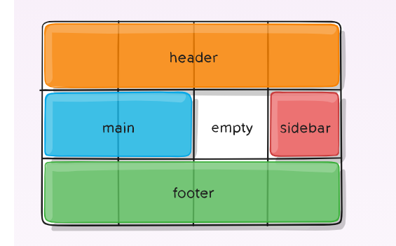

#### CSS Grid Layout
Is a two-dimensional grid-based layout system that aims to do nothing less than completely change the way we design grid-based user interfaces.

To get started you have to define a container element as a grid with display: grid, set the column and row sizes with grid-template-columns and grid-template-rows, and then place its child elements into the grid with grid-column and grid-row. Similarly to flexbox, the source order of the grid items doesn’t matter. 

### Properties for the parent: 

 -  display: grid | inline-grid;
 -   grid-template-columns: 40px 50px auto 50px 40px;
     grid-template-rows: 25% 100px auto; 

- justify-content: start | end | center | stretch | space-around | space-between | space-evenly;

The fr unit allows you to set the size of a track as a fraction of the free space of the grid container. For example, this will set each item to one third the width of the grid container: 
`  grid-template-columns: 1fr 1fr 1fr;` 

- grid-template-areas:        
    " | . | none | ..."
    "...";

 exp: grid-area: header;

 exp : .container {

  display: grid;

  grid-template-columns: 50px 50px 50px 50px;

  grid-template-rows: auto;

  grid-template-areas: 
    "header header header header"

    "main main . sidebar"

    "footer footer footer footer";

Results: 

-  column-gap: <line-size>;
-   row-gap: <line-size>;

- grid-column-gap: <line-size>;
- grid-row-gap: <line-size>;

-  align-items: start | end | center | stretch;

-   grid-auto-flow: row | column | row dense | column dense;

### Properties for Children :

grid-column-start: <number> | <name> | span <number> | span <name> | auto;

grid-column-end: <number> | <name> | span <number> | span <name> | auto;

grid-row-start: <number> | <name> | span <number> | span <name> | auto;

grid-row-end: <number> | <name> | span <number> | span <name> | auto;

grid-area: <name> | <row-start> / <column-start> / <row-end> / <column-end>;

justify-self: start | end | center | stretch;

align-self: start | end | center | stretch;

place-self: center;

 #### Note:
float, display: inline-block, display: table-cell, vertical-align and column-* properties have no effect on a grid item.

-------------------------------------------------------------

## REGEX:

Regular expressions (regex or regexp) are extremely useful in extracting information from any text by searching for one or more matches of a specific search pattern (i.e. a specific sequence of ASCII or unicode characters).

This syntax can be used in almost all the programming languages.

##### Character classes (\d \w \s and .)
.	any character except newline

\w\d\s	word, digit, whitespace

\W\D\S	not word, digit, whitespace

[abc]	any of a, b, or c

[^abc]	not a, b, or c

[a-g]	character between a & g

##### Anchors (Anchors — ^ and $)

^abc$	start / end of the string

\b\B	word, not-word boundary

##### Escaped characters

\.\*\\	escaped special characters

\t\n\r	tab, linefeed, carriage return

##### Groups & Lookaround

(abc)	capture group

\1	backreference to group #1

(?:abc)	non-capturing group

(?=abc)	positive lookahead

(?!abc)	negative lookahead

##### Quantifiers & Alternation (* + ? and {})( | or [])

a*a+a?	0 or more, 1 or more, 0 or 1

a{5}a{2,}	exactly five, two or more

a{1,3}	between one & three

a+?a{2,}?	match as few as possible

ab|cd	match ab or cd

Sources : 

  https://css-tricks.com/snippets/css/complete-guide-grid/

  https://medium.com/samsung-internet-dev/common-responsive-layouts-with-css-grid-and-some-without-245a862f48df

  https://medium.com/factory-mind/regex-tutorial-a-simple-cheatsheet-by-examples-649dc1c3f285