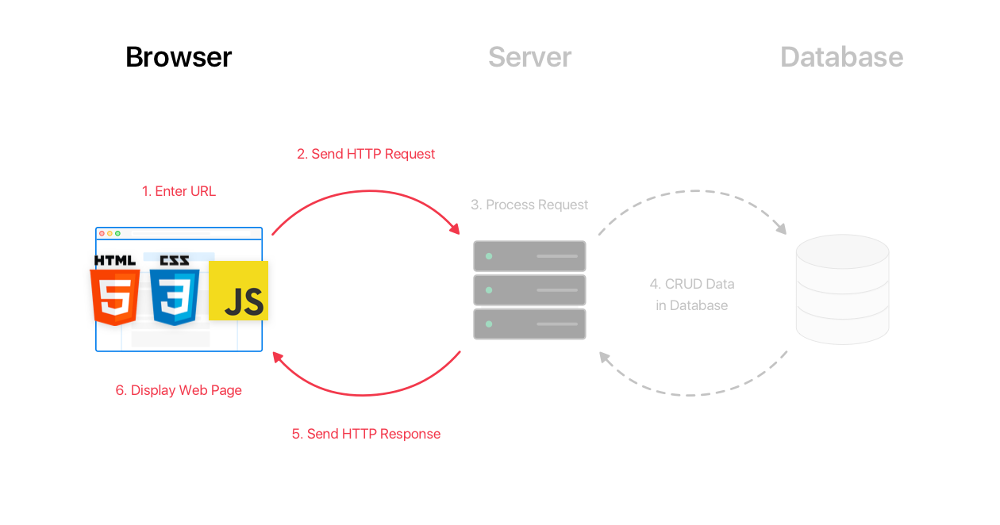

## Heroku and Node.js

Heroku : is a cloud service provider in which allow you to deploy your website.

Node.js : is a run-time environment, it transforms the code into binary langauge to help any computer understand the code.

#### The process to deploy on heroku:
###### Case 1 : if your repo is already using node (it has package.json file), just do the following :
1. Clone the repo.
2. On terminal write `npm i` to download all the dependancies needed.
3. On terminal write `node server.js` to run the server.
4. ACP
5. create an App on the Heroku.
6. connect Heroku app to the github repo.
7. deploy. (you can enable automatic deploy to deploy automaticlly whenever you push to the main)

###### Case 2 : if you create repo from scratch: 
1. On termina write `npm init` and answer the questions to include (package.json file).
2. On terminal write `npm i` to download all the dependancies needed.
4. Start codding ... 
3. When you finish, On terminal write `node server.js` to run the server.
4. ACP
5. create an App on the Heroku.
6. connect Heroku app to the github repo.
7. deploy. (you can enable automatic deploy to deploy automaticlly whenever you push to the main)

# WRRC (Web Request/Response Cycle):

