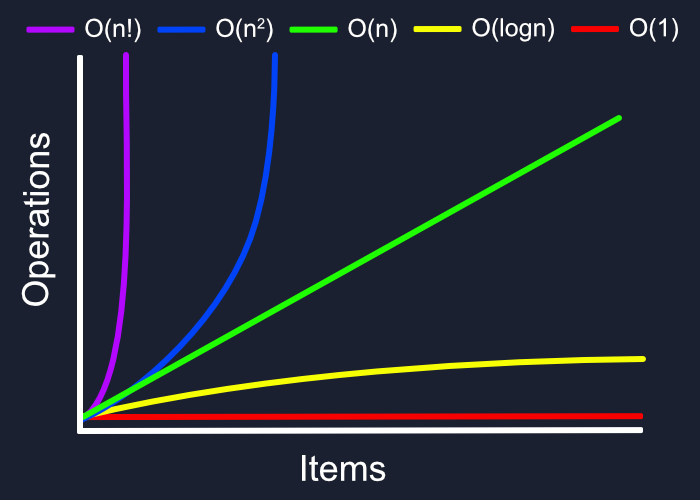

# LINKED LIST 

## Definitions :

- Data Structures : Ways to save data. (objects, linked list, Hash tables, Trees ...)

- Linked list : is a data structure that hold's a nodes (collection of data) that are linked to each other. It is a linear data structure (a sequence and an order to the saved data (sequential traversing)).

- Types of linked lists :
    1. Singly List : a list has one (single) reference direction to the nodes which is `NEXT` node.
    2. Doubly List : a list has two (double) references directions to the nodes, `NEXT` and `Prev` node.
    3. circular list : a list that has the final node references to the head node. 

- Node : refers to single item in the linked list that holds the data.

- Head : refers to the first node in the linked list.

- Current : refers to the node currently being looked at. and when we do some operations to the linked list we define the current as the head node to ensure we start at the beginning.

- Node.next : reference to the next node. And the final element is not node rather its reference to null.

### Operations we can do in the linked list :

 
Traversal : in linked list we can't use `for` or `forEach` loop, therefor we approach it by using `while()` loop. and we can check if the linked list includes a certain value, or we can know the length of the linked list through traversal. Also we can (`Add()` : `AddBefore()`, `AddAfter()` and Print Out Nodes using traversal operation.

### EXAMPLES: 

##### include example:

ALGORITHM Includes (value)
// INPUT <-- integer value
// OUTPUT <-- boolean

  Current <-- Head

  WHILE Current is not NULL
    IF Current.Value is equal to value
      return TRUE

    Current <-- Current.Next

  return FALSE

##### ADD example:

  ALGORITHM Add(newValue)
// INPUT <-- Value to add
// OUTPUT <-- No output

  newNode <-- NEW Node
  newNode.Value <-- newValue
  newNode.Next <-- Head
  Head <-- newNode

##### AddBefore example:

  ALGORITHM AddBefore(newValue, valueToAddBefore)
// INPUT <-- New value, Value to add before
// OUTPUT <-- boolean

  Current <-- Head

  IF Current is equal to NULL
    return FALSE

  WHILE Current.Next is not equal to NULL
    IF Current.Next.Value is equal to valueToAddBefore
      newNode <-- NEW Node
      newNode.Value <-- newValue
      newNode.Next <-- Current.Next
      Current.Next <-- newNode
      return TRUE

    Current <-- Current.Next;

  return FALSE

##### Print example:

ALGORITHM Print()
// INPUT <-- None
// OUTPUT <-- string to console

  Current <-- Head

  WHILE Current is not equal to NULL
    OUTPUT <-- "{Current.Value} --> "
    Current <-- Current.Next

  OUTPUT <-- "NULL"

  ## Difference between Linked Lists and Arrays:

  Arrays have static data structure meaning they need contiguous block of memory to save it's data, While Linked List has dynamic data structure meaning it saves it's node separately in the memory and each item (node) hold data and reference to the next node wherever it is in the memory.

  ## Big O (Time and Space complexity)

  - Time Complexity: How much more runtime do we need as the input of the algorithm increases. 
  - Space Complexity: How much more memory (RAM) do we need as the input of the algorithm increases.

  We express time and space complexity using `Big O Notation`
 

  Types of Big O's 

  

  - O(1)  --> constant Time or space complexity.

  - O(n) --> Linear Time or space complexity.

  - O(log n)  --> Proportional Time or space complexity.

  - o(n^2) --> Quadratic Time or space complexity.

