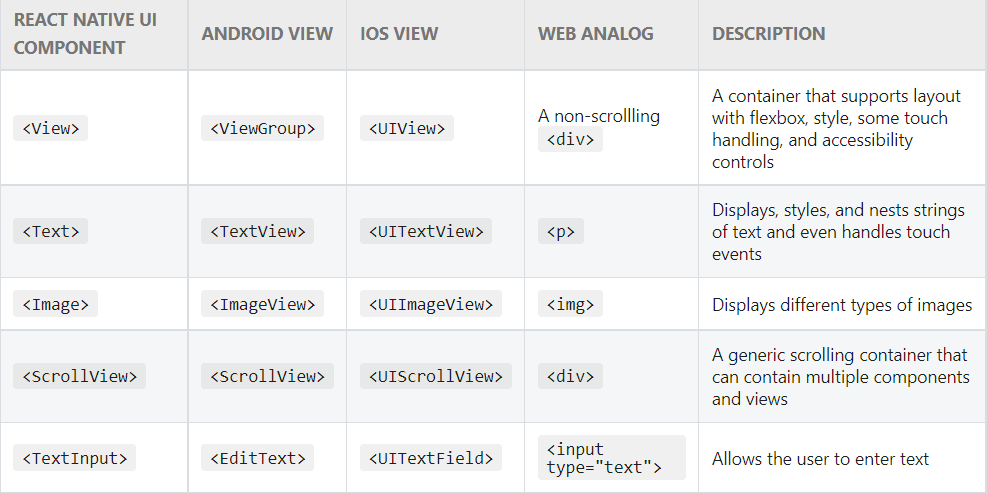

# React-Native


* Compare and Contrast Redux Toolkit with Redux “Ducks”
  Redux Toolkit will help you to manage the state more efficiently, while Redux Ducks It outlines a strategy called 'Ducks' which lays out a way to organize a React/Redux file system at a large scale. The basic idea behind Ducks is to create a file structure that is scalable and easy to follow

* What is the principle advantage of Redux Toolkit?
  To help you create Redux store more efficiently with less code.


* redux toolkit slices --> A function that accepts an initial state, an object full of reducer functions, and a "slice name", and automatically generates action creators and action types that correspond to the reducers and state.

* namespace --->  is a declarative region that provides a scope to the identifiers (the names of types, functions, variables, etc) inside it. Namespaces are used to organize code into logical groups and to prevent name collisions that can occur especially when your code base includes multiple libraries


------


In Android development, you write views in Kotlin or Java; in iOS development, you use Swift or Objective-C. With React Native, you can invoke these views with JavaScript using React components. At runtime, React Native creates the corresponding Android and iOS views for those components. (Platform-Backed Component /Native Component)

## Core Component - React-Native



Your own components can also use props. This lets you make a single component that is used in many different places in your app, with slightly different properties in each place. Refer to props.YOUR_PROP_NAME in your functional components or this.props.YOUR_PROP_NAME

### What's the difference between state and props in React?

In a React component, the props are the variables that we pass from a parent component to a child component. Similarly, the state are also variables, with the difference that they are not passed as parameters, but rather that the component initializes and manages them internally.

`Expo` --> is a framework and a platform for universal React applications. It is a set of tools and services built around React Native and native platforms that help you develop, build, deploy, and quickly iterate on iOS, Android, and web apps from the same JavaScript/TypeScript codebase.

```
First install the CLI tools
npm install --global expo-cli

Create new project
expo init my-project
```

`Expo Snack` --> platform that compile your code and run it for you so it will help you to test your react-native app using different options (Simulator, Emulator, on the web, on your device by scanning the QR code). It's like `Replit`


## Ejecting to ExpoKit
There are some cases where advanced developers need native capabilities outside of what Expo offers out-of-the-box. The most common situation is when a project requires a specific Native Module which is not supported by React Native Core or the Expo SDK.
In this case, Expo allows you to eject your pure-JS project from the Expo iOS/Android clients, providing you with native projects that can be opened and built with Xcode and Android Studio. Those projects will have dependencies on ExpoKit, so everything you already built will keep working as it did before.
We call this "ejecting" because you still depend on the Expo SDK, but your project no longer lives inside Expo Go. You control the native projects, including configuring and building them yourself.

Eject
From your project directory, run `expo eject`. This will download the required dependencies and build native projects under the ios and android directories.
